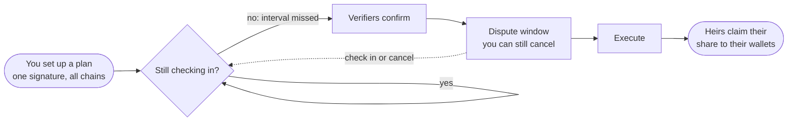
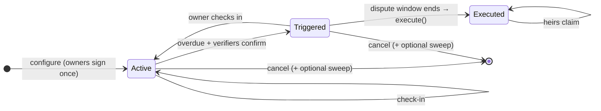

<div align="center">

# 0xWills

### Your crypto survives. Your family thrives.

**Non-custodial crypto inheritance, built as a [Safe](https://safe.global) module.**<br/>
One plan, every EVM chain, no seed phrase ever leaves your hands.

[](LICENSE)
[](src/WillModule.sol)
[](https://getfoundry.sh)
[](test)
[](https://github.com/safe-global/safe-smart-account)
[](#status)

[**Website**](https://0xwills.com) · [**Launch App**](https://app.0xwills.com) · [**X**](https://x.com/0xWillsHQ) · [**Telegram**](https://t.me/zeroxwills)

</div>

---

## The problem

Billions in crypto are locked forever because the only person who could move it is gone. The usual "fixes" are worse than the problem: hand someone your seed phrase today, or trust a custodian with your keys.

## The idea

Your assets stay in **your own Safe** the whole time. You check in once in a while. If you stop, people you trust confirm, a dispute window gives you a last chance to object, and only then can your heirs claim the shares you chose, straight to their own wallets.

No custodian. No seed phrase sharing. No company that can move your money. Not even us.



## Why it's different

| | |
|---|---|
| 🔐 **Non-custodial** | Funds never leave your Safe until an heir claims. The module can only pay the heirs *you* registered. |
| 🌐 **One plan, every chain** | Deployed at the **same address on every chain** (CREATE2). The EIP-712 domain has no `chainId`, so one signature covers your Safes everywhere. |
| ✍️ **Sign once, relay anywhere** | Check-ins, confirmations and cancels are signed once and relayed to every chain. Each chain checks them against *its own* Safe owners: a relayer can delay, never forge. |
| 🧑‍⚖️ **Humans in the loop** | Optional verifiers must confirm before anything moves, then a dispute window gives you time to object. |
| 🛑 **Always cancellable** | Until execution you can cancel, sweep everything back to your wallet and switch the module off, by Safe transaction or signature. |
| 🪙 **ETH + ERC-20s** | Native ETH plus up to 20 tokens per chain, including tokenized stocks on Robinhood Chain. |

## Deployments

`WillModule` v3 · **`0x3a7dFC0e190C278f6AE0D4B2b37E91F3A015ee7c`** (same address on every chain)

| Network | Chain ID | Explorer |
|---|---|---|
| Robinhood Chain testnet | 46630 | [view](https://explorer.testnet.chain.robinhood.com/address/0x3a7dFC0e190C278f6AE0D4B2b37E91F3A015ee7c) |
| Ethereum Sepolia | 11155111 | [view](https://sepolia.etherscan.io/address/0x3a7dFC0e190C278f6AE0D4B2b37E91F3A015ee7c) |
| Arbitrum Sepolia | 421614 | [view](https://sepolia.arbiscan.io/address/0x3a7dFC0e190C278f6AE0D4B2b37E91F3A015ee7c) |
| Base Sepolia | 84532 | [view](https://sepolia.basescan.org/address/0x3a7dFC0e190C278f6AE0D4B2b37E91F3A015ee7c) |

The full end-to-end flow (create Safe → enable module → configure → check in → cancel & sweep → revoke → verifier confirm → execute → heir claim) was run live on all four networks. Every transaction is listed in [`deploy/testnet-smoke-results.json`](deploy/testnet-smoke-results.json).

Mainnet target: **Robinhood Chain**.

## How it works

### Lifecycle (per chain)



### Who signs what

| Action | Signed by | How often |
|---|---|---|
| Create / update plan | Safe owners (threshold) | once for all chains |
| Check in | any one Safe owner | once for all chains |
| Confirm death | each verifier | once for all chains |
| Cancel (± sweep, ± disable module) | Safe owners (threshold) | once for all chains |
| Revoke on a chain the plan never reached | plan creator | once for all chains |
| Relayed claim (optional) | the heir, with a max fee | once per claim |

### Core API

```solidity
configure(Plan plan, address[] signers, bytes[] signatures)   // create / update
checkIn(planId)                    checkInBySig(planId, signedAt, owner, sig)
confirmDeath(planId)               confirmDeathBySig(planId, epoch, verifier, sig)
trigger(planId)                    execute(planId)
cancel(nonce, sweepTo, disable)    cancelBySig(...)    revokeBySig(...)
claim(planId, index)               claimAssets(planId, index, assets)    claimBySig(...)
claimable(planId, index, asset)    getState(planId)    timeUntilOverdue(planId)
```

## Security model

- **Assets never leave the Safe** until an heir claims, and claims always pay the heir's registered address.
- **Only `CALL` through the Safe**, never `DELEGATECALL`.
- **Replay-proof:** nonces, check-ins that only move time forward, votes bound to (plan nonce, last check-in), stale plans rejected.
- **Hostile tokens can't block or double-pay claims:** transfers run with bounded gas and are measured by the Safe's balance change, and every asset is claimed independently.
- **Relayer fees are capped** per chain and priced at most at `basefee + 2 gwei`. A plain `claim()` never takes a fee, so nobody can skim an heir by front-running.
- **Paused when switched off:** if the module is disabled in the Safe, the plan pauses and no fees are taken.
- **Separate testnet and mainnet domains** (`3-testnet` vs `3`), so testnet signatures can never be replayed on mainnet.

### Tests

**149 tests** (373 runs including inherited suites, 512 fuzz runs per fuzz test) against a **real Safe v1.4.1**:

| Suite | What it covers |
|---|---|
| [`WillModule.t.sol`](test/WillModule.t.sol) | Full lifecycle, multi-chain signatures, fees, cancel/sweep, claims, fuzzing |
| [`Review1-4.t.sol`](test) | 92 regression tests from internal security review rounds: authorization, signatures, payouts, hostile tokens, gas griefing |
| [`Digest.t.sol`](test/Digest.t.sol) | EIP-712 digests checked against vectors computed independently with viem (what the app signs) |

### Known limitations

- Rebasing / fee-on-transfer tokens can be split unevenly if heirs claim at different times.
- A token whose transfer needs more than ~236k gas can't be paid out by the module.
- A plan creator who is still a Safe owner can cancel a live plan alone (cancel only, never sweep).

All three are documented and asserted in the test suite (`KNOWN` tests).

## Quickstart

Requires [Foundry](https://getfoundry.sh).

```bash
git clone https://github.com/0xwills/0xwills.git && cd 0xwills
forge install foundry-rs/forge-std@v1.17.0 OpenZeppelin/openzeppelin-contracts@v5.1.0 safe-global/safe-smart-account@v1.4.1
forge build
forge test
```

Deploy and smoke-test scripts (Node 18+, viem) live in [`deploy/`](deploy). See [`deploy/README.md`](deploy/README.md).

## Repository layout

```
src/WillModule.sol         the Safe module (v3)
test/                      Foundry tests (core, review regressions, EIP-712 vectors)
script/Deploy.s.sol        CREATE2 deployment, same address on every chain
script/eip712-vectors.mjs  independent EIP-712 vectors (viem)
deploy/                    Node deploy + end-to-end smoke test, deployments, ABI
```

## Status

> [!WARNING]
> **Testnet beta. Not audited.** Do not use with real funds. Mainnet launch comes after further security work.

Found something? Please report security issues privately with a DM to [@0xWillsHQ](https://x.com/0xWillsHQ), not in a public issue.

## Community

- 🌐 [0xwills.com](https://0xwills.com)
- 🧪 [app.0xwills.com](https://app.0xwills.com) (testnet app)
- 🐦 [@0xWillsHQ](https://x.com/0xWillsHQ)
- 📢 [Telegram channel](https://t.me/zeroxwills) · 💬 [Community chat](https://t.me/zeroxwillsChat)

## License

[MIT](LICENSE) © 2026 0xWills
